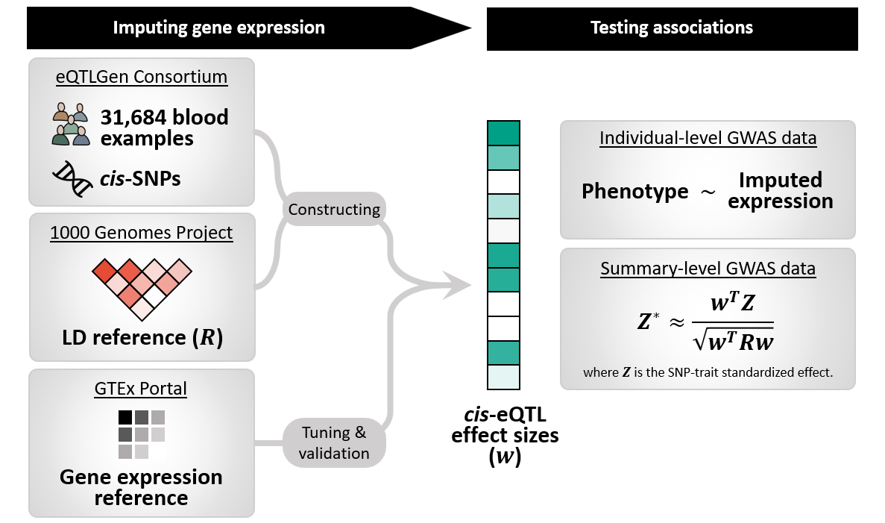

# SUMMIT

[](https://doi.org/10.5281/zenodo.7029793)

**Summary-level Unified Method for Modeling Integrated Transcriptome (SUMMIT)**, is a novel framework designed to improve the expression prediction model accuracy and the power of sequential TWAS by leveraging a very large expression quantitative trait loci (eQTL) summary-level dataset.

Following is an illustration figure of SUMMIT's workflow.

<p align="center">

</p>

For a complete replication of the results in our manuscript, please see our tutorials at OSF.org (https://doi.org/10.17605/OSF.IO/BS3QU).

## Outline

1. [Training imputation model](#TRAIN)
2. [Association test](#TWAS)

## <a name="TRAIN"></a>Training models

mainbody_cpp_final.R is SUMMIT's main function to train imputation models. It has only 2 input arguments ```--name_batch``` and ```--method```. ```--name_batch``` is the desired name for this batch of output and ```--method``` is designated penalized regression method that you can choose from (LASSO, ElNet, SCAD, MCP, MNet).

### Data preparation

#### Reference panel

We used data from 1000 Genome European ancestry as our reference panel. With standard quality control procedure, we splitted the processed data by chromosome.

#### eQTLgen summary statistics

As for the summary-level eQTLgen data, you can download from https://www.eqtlgen.org/cis-eqtls.html. Notice that the eQTLgen dataset is over 3.5Gb, we have splitted them into small ```.RData``` files (You can download from LINK-2) by gene_id after standard quality control. If you do wish to process the summary-level eQTLgen data on your own, please do **NOT** change the column names or column order from eQTLgen's original data.

#### GTEx-7 and GTEx-8 data

As we used both data from GTEx-7 and GTEx-8 as our basis for tuning and model validation, the data we used can be download from:

processed genotype matrix (*X*): LINK-3.

expression level (*Y*): LINK-4.

### Data alignment

SUMMIT offers two approaches to align the reference panel with the summary-level data. If you wish to align your data by rsID, use mainbody_cpp_rsid_precise.R. If you wish to align your data by chromosome+position, use mainbody_cpp_pos_precise.R.

### Example run

After we prepared the data, we can train imputation models via the following single line.

```
Rscript mainbody_cpp_rsid.R \
--name_batch SCAD_1e-6_rsid \
--method SCAD \
```

### Built-in parallel computing

Both ```mainbody_cpp_rsid_precise.R``` and ```mainbody_cpp_pos_precise.R``` contain a snippet that guarantees mutual exclusion for every sub-job. Simply put, you can run ```mainbody_cpp_rsid_precise.R``` and ```mainbody_cpp_pos_precise.R``` as many times as you want and it will figure out if there is unfinished job on its own.

### Trained imputaion models

All the ready-to-use SUMMIT Whole_Blood imputation models can be found here: LINK-5.

## <a name="TWAS"></a>Association test

### Download our pre-calculated models

We have uploaded our pre-calculated expression imputation models (Tissue: whole blood) to Zenodo[![DOI]](https://doi.org/10.17605/OSF.IO/BS3QU).

The Zenodo repository contains two zip files. ``SUMMIT-weight-pos.zip`` contains models that use chromosome plus position (CHR + POS) to match the SNPs in our models to the SNPs in GWAS summary data; ``SUMMIT-weight-rsid.zip`` uses rsID to match.

### Pre-process your summary statistics using APSS

APSS is an interactive R function that can easily process GWAS summary statistics and shape GWAS summary statistics into any desired format.

APSS has 3 principal input arguments.

```directory.working``` is the working directory.

```filename``` is the name of the summary statistics file to be processed.

```BIG``` is the number of GBs and default is 2. If ```BIG``` is set as 2, then for any summary statistics file bigger than 2GB, APSS will do an exploratory read first. By doing so, APSS could significantly shorten the runtime and handle summary statistics files bigger than 10GB. 

### The must-have columns

You can use any summary statistics files with reasonable quality control just as long they contain specific columns for SUMMIT to work with.

The must-have columns are ```A1, A2, Z, CHR```.

If you are using the rsID-aligned models, you must also include ```SNP``` column.

If you are using the position-aligned models, you must also include ```POS``` column.

### The flags

```step2_pos.R``` is SUMMIT's function for association test using position-aligned models.

```step2_rsid.R``` is SUMMIT's function for association test using rsID-aligned models.

For both functions, the input arguments are:

```--models``` is the path of the pre-calculated models (Please make sure that the folder contains only model files).

```--path.ref``` is the path of the reference panel used plus the prefixes of reference panel files.

```--trait``` is the name of the input summary statistics files.

```--path.out``` is the path of the output folder.

```--parallel``` is the number of parallel instances

### Parallelization

Unlike other TWAS methods (e.g., PrediXcan), SUMMIT can be a bit more time-consuming. Because SUMMIT does not use a designated correlation matrix (LD matrix) and has more flexibility, the SUMMIT pipeline would spend more time matching models, summary statistics, and reference panel. In addition, each SUMMIT's pre-calculated model file contains models from 5 different types of penalized regression, hence more computation time is needed.

However, with proper parallelization, a complete association study usually takes less than 10 minutes.


### Example run

```
Rscript step2_pos.R \
--models my-model-folder-pos
--path.ref my-reference-panel/1000G.EUR.ALLSNP.QC.CHR \
--trait my-trait-1 \
--path.out my-output-folder \
```

```
Rscript step2_rsid.R \
--models my-model-folder-rsid
--path.ref my-reference-panel/1000G.EUR.ALLSNP.QC.CHR \
--trait my-trait-2 \
--path.out my-output-folder \
```

## License

Maintainer: [Zichen Zhang] (zz17@fsu.edu)

[MIT](http://opensource.org/licenses/MIT)

Copyright (c) 2013-present, Zichen Zhang (zz17@fsu.edu), Chong Wu (cwu3@fsu.edu)
